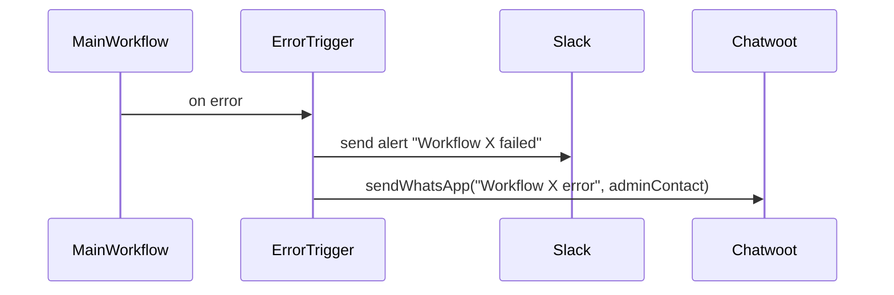
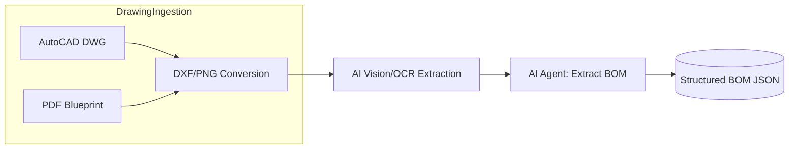
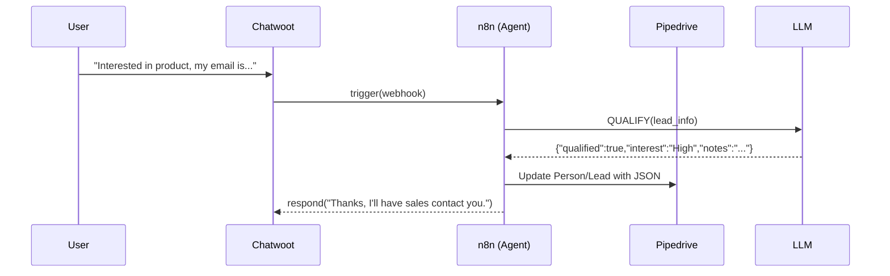
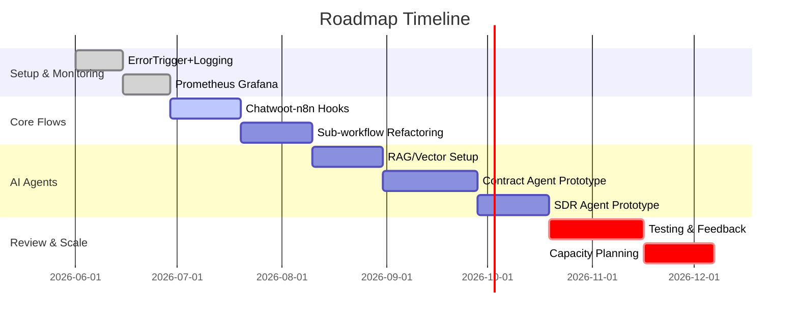

# Executive Summary

This report reviews your existing AI automation stack and provides a detailed roadmap for productionizing n8n-based agents. Your current stack includes: **n8n** (workflow engine), **PostgreSQL** (with PGVector extension) for data storage, **Supabase** (Postgres-hosting), **Redis** (in-memory cache), **RabbitMQ** (message broker), **MinIO** (S3 storage), **Chatwoot** (multichannel messaging), **Pipedrive** (CRM), **Notifica-me Hub** and **NFTY** (notification services), **OpenRouter** (API key manager), **Traefik/Docker Swarm/Portainer** (infrastructure), and monitoring with **Uptime Robot/Kuma**. We summarize best practices for n8n (modular sub-workflows, error trapping, structured outputs), discuss data patterns (RAG, vector DB choices, Postgres vs. Redis), outline observability tools (Prometheus/Grafana, error triggers, Slack/WhatsApp alerts), and propose concrete agent designs (Contract analyzer, Technical quote, SDR). The report ends with a list of open questions and a prioritized roadmap. All recommendations are backed by official sources (n8n docs, OpenAI blog, etc.) and the user transcript.

## 1. Current Stack and Tools

Your **stack** comprises a mix of open-source and cloud tools:

- **n8n** (workflow automation): orchestrates AI agents and external APIs.  
- **PostgreSQL** (ACID database): stores persistent data.  
- **Supabase**: (managed Postgres) hosting your Postgres databases.  
- **PGVector**: Postgres extension for vector embeddings (avoids a separate DB).  
- **Redis**: in-memory cache (used only for ephemeral data like session tokens).  
- **RabbitMQ**: message broker for decoupling and scaling tasks.  
- **MinIO**: S3-compatible object storage (for files, images, OCR results, etc.).  
- **Traefik** on **Docker Swarm**: reverse-proxy/ingress routing (managed via Portainer).  
- **Hostinger VPS**: self-hosted servers running the above via Docker.  
- **OpenRouter**: API gateway for LLM API keys (clients pay their own tokens through OpenRouter).  
- **Chatwoot**: open-source customer chat inbox (handles WhatsApp/Meta Inbox, etc.).  
- **Pipedrive**: CRM for leads and deals (used via API from n8n).  
- **Notifica-me Hub / NFTY**: push/notification services (e.g. for mobile push or SMS alerts).  
- **Uptime Robot / Uptime Kuma**: uptime monitors to check services (Ping n8n, Chatwoot, etc.).  

Your priorities: n8n workflows, AI agents, and robust infra. Next sections cover how to best use each tool.

## 2. n8n Workflow Architecture and Best Practices

**Modular Workflows:** Break large automation into smaller **sub-workflows** or “agents”. n8n documentation explicitly recommends calling one workflow from another to build **modular, microservice-like workflows** (using the “Execute Workflow” node) – this helps avoid memory limits on big workflows【35†L1538-L1541】. For example, one sub-flow might handle CRM updates, another agent AI conversations, etc. 

**Execute vs Webhook:** To invoke sub-flows, use n8n’s built-in **Execute Workflow** (or Execute Sub-workflow Trigger) nodes, not external HTTP calls. Using an HTTP/Webhook adds overhead (new process, network hop) and can slow performance【37†L49-L54】. An internal Execute node is more efficient: it can even run asynchronously (fire-and-forget) if configured. For example: 

```mermaid
graph LR
  UserChat →|Webhook| ChatwootInbox
  ChatwootInbox →|n8n Trigger| MainFlow
  MainFlow → SubFlow1[Execute Workflow: Qualification]
  MainFlow → SubFlow2[Execute Workflow: Scheduling]
  MainFlow → SubFlow3[Execute Workflow: CRM Update]
```

**Structured Output Pattern:** Always have the AI output *structured JSON* or key/value data. Then parse that with n8n code or tools. This avoids prompting LLM to do unsafe actions. For instance, n8n docs show an AI “Website Chatbot” that extracts user input into JSON with fields like `email` and `description`【34†L102-L110】. That JSON is then fed to a Google Sheets (CRM) sub-workflow. In practice, you’d configure your AI (e.g. via the n8n “AI” node) to answer in JSON schema, and connect that to a **Code** or **Function** node that processes the JSON (e.g. calling an HTTP Request node to your CRM API). This way, the AI’s only job is to *analyze text*, not to manipulate databases directly.

**Error Handling:** Use the **Error Trigger** node to catch failures. Any workflow can specify an “Error Workflow” (via Settings > Error workflow) where an Error Trigger node receives details if the main flow crashes【19†L1537-L1540】. In that handler, you might log the error, notify an admin, or attempt a retry. Combined with structured outputs, this ensures your agents fail gracefully.

**Node Limits and Parallelization:** n8n scales to *hundreds* of nodes, but practical limits depend on memory. If a single flow has >200 nodes or does heavy data work, it can slow down. Instead:
- **Batching:** Break loops into chunks. E.g. if processing 1000 leads, run 10 subflows of 100 each in parallel via n8n’s “SplitInBatches” node + “Execute Workflow”.
- **Parallel triggers:** Use multiple triggers or schedule nodes for asynchronous tasks.
- **Avoid loops in main flow:** If a step is CPU-heavy or I/O-bound, put it in a separate workflow and trigger it (using n8n’s own queues or RabbitMQ).

**Example Implementation:** A simple n8n example: an incoming message trigger calls an AI agent node, which outputs JSON like `{"status":"Qualified","next_step":"Call CEO"}`. Then a Code node would do:
```javascript
// Parse AI output
const data = JSON.parse($input.item.json.aiResponse);
return [{ json: { status: data.status, task: data.next_step } }];
```
Then an HTTP Request node updates your CRM with those fields.

**Checklist:** 
- Use sub-workflows for repeated or heavy tasks【35†L1538-L1541】.  
- Output data in structured form (JSON schema) and validate.  
- Connect “Execute Workflow” nodes for modular logic; avoid HTTP/webhook chaining【37†L49-L54】.  
- Configure each workflow’s Error Workflow with an Error Trigger to catch and handle failures【19†L1537-L1540】.

## 3. Data, RAG, and Memory Patterns

**PostgreSQL + PGVector:** You run Postgres as your main DB (ACID-compliant). For retrieval-augmented generation (RAG), you can store embeddings in Postgres using **PGVector**, as a Postgres extension. This avoids the complexity of a separate DB like Qdrant. Modern benchmarks show that Postgres with the right extensions is competitive with specialized vector DBs【13†L246-L254】. PGVector lives in your existing DB (vectors as a new column with an index). For most scale (up to millions of vectors), PGVector is fine. Qdrant (or Pinecone) can still be used if you have massive scale or need separate clusters, but for simplicity PGVector is preferred【14†L28-L33】【13†L246-L254】.

| Option      | Description                            | Pros / Cons                 |
|-------------|----------------------------------------|-----------------------------|
| **PGVector**| Postgres extension for embedding vectors| ✔ Single DB; SQL + vectors <br> ✘ Postgres resource limits |
| **Qdrant**  | Standalone vector DB                   | ✔ Scalable, optimized for ANN <br> ✘ Additional service to maintain |

**Redis vs Postgres:** Use Redis only for **volatile caches or locks**, *not* for persistent data. Redis is in-memory (no built-in durability by default). For conversation history or critical state, use Postgres. For example, use Redis to cache a short-lived conversation context ID, but record all chat messages in Postgres (via n8n Chat Memory). 

**Conversational Memory:** n8n’s **Chat Memory** feature (backed by Postgres) automatically creates a table for each session【7†L55-L63】. Best practice is one database per client (each client’s data is isolated). Within that DB, use separate tables/schemas as needed (e.g. one table for chat history, one for user profiles, etc.). In n8n, enabling Postgres chat memory will “automatically create the necessary table to store chat history”【7†L55-L63】. Example schema (auto-generated by n8n) is like `(id SERIAL, session_id TEXT, message JSONB, sender TEXT, created TIMESTAMP)`. Keep the DB per client to avoid cross-talk. In practice, your n8n Agent Node will append each new message to this table, and retrieve previous messages for context.

**RAG (Retrieval Augmented Generation):** Use RAG when AI needs up-to-date or large knowledge (e.g. product catalogs, prices, docs) that you cannot fit in prompts. For instance, you mentioned not loading full price tables into AI; instead store prices in a DB or document and query it. According to n8n’s guidance, RAG is “useful where LLMs need info not in initial training data, such as internal documents”【10†L58-L66】.  A pattern: on each turn, query a vector DB (PGVector) or simple DB for relevant bits (e.g. use n8n’s **IF**/HTTP nodes or the built-in Vector Search node), then append those facts to the prompt. For dynamic data (promotions, inventory), you can keep a Google Sheet or JSON doc that the agent reads at runtime, as your conversation notes suggest. The key is: **volatile or large data goes to RAG/external**, not the prompt.

## 4. Monitoring and Observability

**n8n Metrics (Prometheus/Grafana):** n8n can expose Prometheus metrics by enabling `N8N_METRICS=true`【43†L1532-L1540】. This provides gauges (e.g. active jobs, completed jobs) on `/metrics`. You can install Prometheus to scrape this endpoint and build Grafana dashboards. For example, n8n’s docs show enabling queue/job metrics via env vars【43†L1547-L1555】. Use Grafana to visualize workflow throughput, failures, and resource usage.

**Logging and Traces:** Collect logs from n8n containers (stdout) and from Postgres/Redis. Consider **Grafana Loki** or Elasticsearch for log aggregation. Tag each log with workflow ID and agent name. If using Docker Swarm, route container logs to a central syslog or file volume.

**Error Alerts (n8n):** As noted, set up an **Error Trigger** workflow that runs on any failure【19†L1537-L1540】. Within it, send alerts: e.g. use n8n’s **Slack** node or **HTTP Request** to an alerting service. You might also use the Chatwoot node to send yourself a WhatsApp alert on errors. (Chatwoot supports sending messages to agents’ contacts.) Alternatively, NFTY can push mobile notifications. For example: 

This covers immediate alerts. You can also schedule a cron (Interval) node that periodically (e.g. every 5m) checks for stuck executions via the n8n API, similar to templates【17†L83-L91】.

**Uptime and Infrastructure Monitoring:** Use Uptime Kuma or Robot to ping critical endpoints (Chatwoot web UI, n8n webhooks). If any go down, Kuma can trigger a notification (Slack/Telegram). For system metrics (CPU, RAM), use a stack like **Prometheus Node Exporter + Grafana**. On a VPS, also ensure disk space and memory alerts. For more robust ops, integrate **PagerDuty** or similar, which can receive webhooks or emails from n8n and escalate.

**Webhook vs Sub-workflow in Alerts:** As [37]† (Community n8n) indicates, do *not* use external webhooks for alerting if you can send the message internally. For example, instead of having a workflow make an HTTP call to itself, use the Error Trigger directly, which is more reliable and faster【37†L49-L54】.

## 5. Infrastructure Troubleshooting Checklist

When problems arise in a containerized setup, follow these steps:

1. **Check Logs:** Examine logs of n8n (web + worker), RabbitMQ, Redis, Chatwoot, Postgres. Often the error is logged (e.g. Redis connectivity, OOM kills). Use `docker logs` or your log aggregator.

2. **Identify Bottleneck:** Look at the Prometheus metrics dashboard. Are executions failing or just slow? Is the queue backed up (`n8n_scaling_mode_queue_jobs_waiting` gauge【43†L1574-L1582】)? High DB or Redis latency?

3. **Container Health:** If the container crashed, inspect `docker ps` and `docker logs`. Common causes: out-of-memory (increase swap or memory), disk full (truncate logs), or CPU saturation.

4. **Redis:** If Redis is involved (e.g. n8n Queue uses Redis/Bull), ensure Redis is up. A locked or full-memory Redis will stall queues. Restart or increase resources.

5. **RabbitMQ:** Check if message queue has backups or unacked messages. If queue size is very large, consider scaling or processing in batches.

6. **Redeploy / Flush:** For severe hangs, `docker restart` the affected container. Sometimes flush job queues (`n8n restart --force` to clear the queue). Caveat: this may lose unsaved work.

7. **Scale Vertically:** If traffic spikes (as seen in logs/transcripts: client drove 2K messages at once), consider adding more worker replicas or increasing CPU/memory of VPS.

8. **Configuration Errors:** Verify environment variables (like `N8N_DATABASE_TABLE_PREFIX`, DB URLs, etc.). In distributed mode, check that `EXECUTIONS_PROCESS=queue` or `own` is set as intended.

9. **Check for Loops:** If a flow inadvertently loops (e.g. webhook triggers itself), it can saturate. Look for runaway executions.

10. **Time Correlation:** If issue started at a time of high usage or new deployment, correlate with events (e.g. client increased ad spend, new code release).

Regularly automate (1) alerts on high error rate, (2) daily health checks (container up, DB connection alive).

## 6. Agent Designs

### 6.1 Contract Analyzer Agent

**Goal:** Ingest contracts (PDF/DOC) and extract key clauses/values.

```mermaid
flowchart LR
  subgraph Ingestion
    A[File Upload (PDF/DOC)] --> B[OCR/Text Extraction]
  end
  B --> C[Vector Index Search (RAG)]
  C --> D[AI Agent: Parse Contract]
  D --> E[(Structured JSON output)]
  E --> F[Reviewer/Database]
```

- **Upload/Fetch:** Contract PDFs come via email/chat or S3. Use n8n File nodes or S3 nodes to retrieve.
- **OCR/Parsing:** For scanned or image PDFs, run OCR (Tesseract or an OCR API). If DOCX, extract text directly.
- **RAG Retrieval:** Split text into chunks. Query PGVector for similar contract templates or reference docs if available. This narrows context (e.g. pull sample indemnity clauses).
- **AI Prompt:** Send relevant parts to LLM. Example prompt: *“Extract these fields: Parties, Effective Date, Term, Payment, Notices, and flag any non-standard clause. Cite sources from text.”*. Use system prompt with schema for JSON.
- **Output:** Expect JSON like: 
  ```json
  {
    "partyA": "Acme Inc",
    "partyB": "Global LLC",
    "effective_date": "2024-01-15",
    "term": "24 months",
    "payment": "$5,000 monthly",
    "notes": "Warranty clause extended to 2 years (non-standard)"
  }
  ```
- **Review:** Send JSON to human via Chatwoot or email for verification. Human edits if needed.
- **Storage:** Save final JSON to DB (Postgres table). 

**Considerations:** Keep prompt size small (use RAG!). Agents should not handle extremely sensitive legal evaluation; leave ultimate judgment to humans. Ensure no PII leaks in prompts (redact SSNs, etc.). Use separate DB table for contracts.

### 6.2 Technical Quote (DWG/PDF→BOM) Agent

**Goal:** Read CAD drawings or PDFs and generate a bill of materials (BOM).



- **Format Conversion:** Convert DWG to a common format if needed (DWG→DXF or image). Tools: ODA File Converter, AutoCAD command line, or cloud API.
- **OCR/Extraction:** Use an AI vision model (or APIs like Meta Llama CV or Azure OCR) to read labels, dimensions. Alternately, if DXF format is parseable, extract entities via a library (if coding).
- **AI Prompt:** Provide the text content and ask for material list. E.g. *“List all components and quantities from this drawing.”* 
- **Output:** JSON BOM, e.g. `[{"item":"Steel Bolt","qty":50},{"item":"PanelA","qty":5}]`.
- **Verification:** Have an engineer review. Possibly show original snippet (via RAG citing “see drawing, note label 10: 20 units”).
- **Integration:** Pass BOM to pricing agent or ERP via API.

**Tools:** Specialized services exist (Energent.ai claims ~94% accuracy【27†L68-L75】). Consider commercial CAD parsers if budget allows. Without specialized tools, rely on high-quality prompts plus post-validation.

### 6.3 SDR Agent with Pipedrive

**Goal:** Engage leads and update Pipedrive CRM automatically.



- **Trigger:** Chatwoot receives incoming message (WhatsApp or web chat). n8n uses Chatwoot Trigger node.
- **Conversation:** Use n8n’s AI Chat node for multi-turn. The agent should have a clear persona (“sales SDR bot”) and stick to qualification only (don’t schedule or close).
- **Output:** At end, output JSON: `{ "name":"Alice", "email":"alice@example.com", "status":"Qualified", "next_step":"Schedule Demo", ...}`.
- **CRM Update:** Use Pipedrive nodes (or HTTP Request) to create/update Person and Deal. (n8n has built-in Pipedrive operations【32†L591-L598】.)
- **Example (n8n Pipedrive Node):** 
   - *Create/Update Person:* name and email fields from JSON.  
   - *Create Deal:* attach to that person, with status from JSON.
- **Responses:** Use Chatwoot node to send a confirmation message in chat.
- **Post-Processing:** If `qualified=false`, route to human with tag.

**Sample Prompt:** “You are a sales SDR bot. Ask qualifying questions. When done, output JSON with `qualified` (true/false) and notes.” 

**Notes:** Keep conversation logs short (limit 10 messages). Use Redis or n8n memory only for current chat; entire history is in Postgres.

## 7. Unanswered Questions & Assumptions

- **Traffic & Scale:** What is peak messaging volume? (The user mentioned a spike of ~2000 msgs; need expected concurrency.)  
- **SLA / Latency:** Are there SLA requirements for response times?  
- **Data Retention:** How long to keep conversation and CRM data? (DB storage planning.)  
- **Authentication:** Does Chatwoot use OAuth/WhatsApp Business API? Details on WhatsApp integration needed.  
- **VPS Specs:** What are the Hostinger VPS sizes (CPU, RAM, storage)? Is horizontal scaling (multiple VPS) planned?  
- **Compliance:** Are there privacy/regulations (GDPR, HIPAA) affecting data handling, encryption, etc.?  
- **Document Formats:** Contract/orçamento docs – PDF only or also images? Language(s) of documents (only Portuguese or multi-language)?  
- **Token Costs:** Rough expected token usage per session for budgeting.  
- **Client-paid API Keys:** How exactly will clients provide GPT keys via OpenRouter? (Process flow.)  
- **Integrations:** Clarify use of “Notifica-me Hub” and “NFTY” (roles & APIs).  
- **Monitoring Thresholds:** What uptime targets and alert conditions (error rate, CPU%) do you need?  

Without answers above, we assumed moderate load (few hundred chats/day), Portuguese language, and one-month retention. Any change could adjust the design.

## 8. Implementation Roadmap

| Phase       | Tasks (approx dates)             | Duration | Notes                        |
|-------------|----------------------------------|----------|------------------------------|
| Quick Wins (1-2 weeks) | Configure Error Trigger workflows in n8n; set up basic logging and Uptime monitors (Kuma); define DB schemas. | 1-2 wks   | Improves reliability immediately. |
| Medium (3-6 weeks) | Implement sub-workflows for common tasks (CRM updates, message handling); enable Prometheus metrics + Grafana. Develop Chatwoot→n8n trigger flows. | 2-4 wks   | Core architecture, monitoring. |
| Medium (2-3 months) | Build RAG pipeline (PGVector index, document store); develop skeleton of AI agents (prompts, structured outputs). | 4-6 wks   | Create Contract and SDR agents (basic). |
| Long-term (3-6 months) | Refine agents (OCR for contracts, CAD parsing, multilingual support); production testing; scale-out infra (replicas, backup). | 8-12 wks  | Ensure security/compliance. |



## 9. Key Comparisons

| Component        | Options                  | Pros/Cons / Use Case                                          |
|------------------|--------------------------|--------------------------------------------------------------|
| **Vector DB**    | PGVector (Postgres)      | ✔ Single DB, simpler backup <br> ✔ Good up to millions of vectors<br> ✘ Shared resources. |
|                  | Qdrant (external)        | ✔ Scales independently<br> ✔ Advanced indexing features<br> ✘ Extra management overhead. |
| **Monitoring**   | Prometheus + Grafana     | ✔ Open-source, flexible <br> ✔ Can scrape n8n / host metrics<br> ✘ Setup complexity. |
|                  | Uptime Robot / Kuma      | ✔ Easy uptime alerts (HTTP) <br> ✘ Only basic up/down status. |
| **Alerts**       | Slack/Chatwoot/WhatsApp  | ✔ Immediate human notification <br> ✘ May need custom integration nodes. |
|                  | PagerDuty/Email          | ✔ Industry-standard on-call <br> ✘ Cost, configuration. |
| **OCR/CAD**      | Tesseract (open)         | ✔ Free, offline <br> ✘ Variable accuracy, needs tuning. |
|                  | Cloud OCR API (Azure)    | ✔ High accuracy <br> ✘ Cost per page / call. |
|                  | Energent.ai (CAD AI)     | ✔ Designed for engineering docs <br> ✘ Commercial product. |

## 10. Sample n8n Workflow Snippet

*Example: Error Alert Workflow (brief)*

```plaintext
[Error Trigger Node] -- onError --> [Set Slack Message]
[Set Slack Message] --> [Slack Node: Post message to #alerts]
```
- The **Error Trigger** node (in n8n) automatically captures failures from linked workflows【19†L1537-L1540】.  
- A **Set** node formats a message (e.g. JSON: `{"text":"Workflow X failed at node Y"}`), then a **Slack** or **Chatwoot** node sends it to the admin. 

## Sources

- n8n Official Docs (Sub-workflows【35†L1538-L1541】, Error Trigger【19†L1537-L1540】, Prometheus metrics【43†L1532-L1540】).  
- n8n Community and Blog (Structured output example【34†L102-L110】, performance note on Webhook vs Execute【37†L49-L54】).  
- OpenAI “AI on AI” (Contract Data Agent design【25†L68-L77】【25†L80-L89】).  
- Technical AI Reports (CAD parsing accuracy【27†L68-L75】).  
- PGVector and Qdrant documentation and comparisons【14†L28-L33】【13†L246-L254】.  
- Pipedrive API Docs (overview of deals/persons).  
- Chatwoot Docs (architecture, rollout).  
- Monitoring best practices (n8n metrics【43†L1532-L1540】, Prometheus).  

**Unanswered Questions (must clarify):** traffic volumes, exact AWS/VPS specs, languages/compliance needs, API usage limits, etc. Each of these will affect the final design and resource planning.

